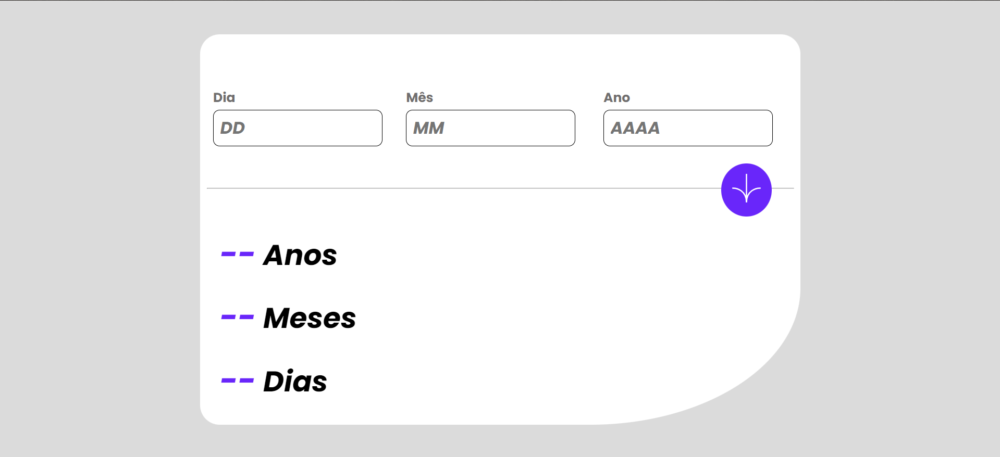
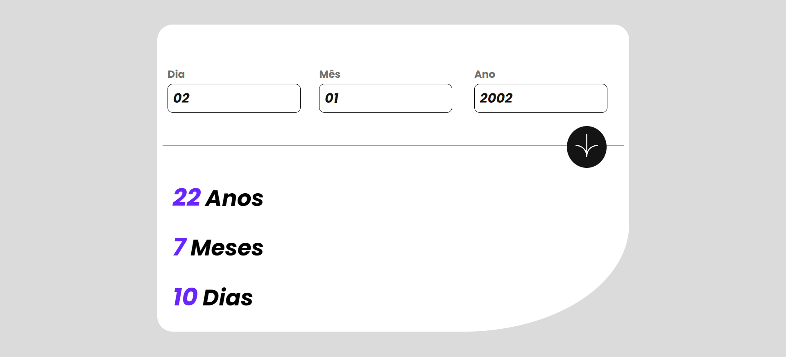
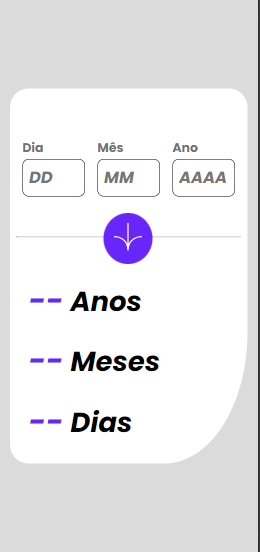
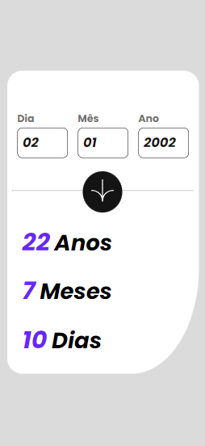

# Sobre Projeto:

## Projeto criado para treinar a funcionalidade de integração com uma API

Este projeto foi criado utilizando HTML, CSS e JavaScript.  

O projeto "age-calculator-app" é um aplicativo que calcula a idade do usuário. O projeto está hospedado no GitHub e possui uma interface simples e intuitiva.

### Principais Funcionalidades:

Calcular a idade do usuário com base em sua data de nascimento;

Exibir a idade do usuário de forma clara e concisa;

## [Link do Projeto](https://willy-braga.github.io/gerador-de-conselhos/)

### Linguagens e Ferramentas

  
  
 

## Layout

### Desktop

### Mobile

### Contribua com o projeto

- Realize o Fork
- Faça as modificações necessárias
- Realize a Pull Request (PR)

### Contribuidores

### Autor

[Licenca MIT License](http://creativecommons.org/licenses/by)
